# Skill Bridge – AI-Powered Youth Employment & Career Roadmap Platform

> SDG 8: Promote sustained, inclusive and sustainable economic growth, full and productive employment and decent work for all.

Skill Bridge is a full-stack web platform that helps students, fresh graduates, and job seekers:
- Understand their skills and background  
- Discover suitable job opportunities  
- Identify gaps and receive personalized learning recommendations  
- Generate a clear, actionable career roadmap  
- Interact with an AI mentor for career guidance  

The project implements the **Part 1 (Pre-Hack)** and **Part 2 (Onsite)** requirements of the Hackathon Project Brief for an **AI-Powered Youth Employment & Career Roadmap Platform**.

---

## Table of Contents

1. [Core Features](#core-features)
   - [Part 1 – Foundation Features](#part-1--foundation-features)
   - [Part 2 – AI & Advanced Features](#part-2--ai--advanced-features)
2. [Architecture](#architecture)
3. [Tech Stack](#tech-stack)
4. [Screenshots](#screenshots)
5. [Folder Structure](#folder-structure)
6. [Getting Started](#getting-started)
   - [Prerequisites](#prerequisites)
   - [Backend Setup (BE)](#backend-setup-be)
   - [Frontend Setup (FE)](#frontend-setup-fe)
7. [Environment Variables](#environment-variables)
8. [Core User Flows](#core-user-flows)
9. [AI & External Services](#ai--external-services)
10. [Data & Seeding](#data--seeding)
11. [Development Notes & Scripts](#development-notes--scripts)
12. [Future Improvements](#future-improvements)
13. [License](#license)

---

## Core Features

### Part 1 – Foundation Features

**1. Authentication & User Management**

- User registration and login with secure password handling  
- Basic validation (required fields, email format, password length, etc.)  
- Role-based access (e.g., Admin, Job Seeker, etc.)

**2. User Profile & Skill Input**

- Dedicated profile page for each user  
- Users can:
  - Add/edit personal information (name, education, experience level, preferred track)  
  - Add or edit a list of skills (e.g., “JavaScript”, “Communication”, “Graphic Design”)  
  - Describe projects or brief experience summaries  
- Support for storing pasted CV text or profile notes for later AI analysis

**3. Jobs & Opportunities Database**

- Structured jobs table/collection including:
  - Job title, company/organization  
  - Location / Remote  
  - Required skills and recommended experience level  
  - Job type (Internship, Part-time, Full-time, Freelance)  
- Jobs listing page with filters and detail view

**4. Learning Resources / Courses Collection**

- Learning resources table including:
  - Title, URL  
  - Related skills  
  - Free / Paid indicator  
- Dedicated page to browse and filter resources mapped to common skills

**5. Basic Matching Logic (Non-AI)**

- Simple, transparent rules using:
  - User selected skills + preferred track  
  - Overlap with required job skills  
- Recommended jobs and learning resources with short explanations like  
  _“Matches: JavaScript, HTML”_

**6. User Dashboard & UI**

- Dashboard view for logged-in users showing:
  - Profile snapshot and skills  
  - Recommended jobs  
  - Recommended learning resources  
- Clean, responsive design focusing on usability over heavy visuals

---

### Part 2 – AI & Advanced Features

**1. Smart Skill Extraction from CV / Profile**

- Users can upload/paste CV text or rely on their profile data  
- AI/NLP layer extracts:
  - Key technical and soft skills  
  - Possible roles or domains  
- Extracted skills are shown as editable tags in the profile

**2. Intelligent Job Matching with Match Percentage**

- Advanced matching score per job:
  - Overlap between user skills and required job skills  
  - Alignment of experience level and preferred track  
- Display:
  - Match percentage (e.g., “72% match”)  
  - Key reasons such as **“Matches React, JS, HTML; missing Redux and TypeScript”**  
- Highlights top jobs where the user should apply first

**3. Skill Gap Analysis & Learning Suggestions**

- For partially matched jobs:
  - Clear “Skill Gap” section (missing/weak skills)  
  - Recommended learning resources to close each gap  
- Visual skill gap view and actionable next steps

**4. AI-Generated Career Roadmap (Mandatory)**

- AI-powered roadmap generator using:
  - Current skills (from profile or CV)  
  - Target role (e.g., Frontend Developer, Data Analyst)  
  - Time horizon or learning intensity (configurable)  
- Outputs a **step-by-step plan** with:
  - Phases or weeks/months  
  - Topics/technologies to learn  
  - Mini-project ideas  
  - When to start applying for internships or jobs  
- Roadmap is:
  - Visible inside the app  
  - Saved for the logged-in user  
  - Optionally exportable (e.g., copyable text or PDF via browser print)

**5. CareerBot / Mentor Assistant**

- Conversational assistant (“AI Mentor”) that answers questions like:
  - “Which roles fit my skills?”  
  - “What should I learn next to become a backend developer?”  
  - “How can I improve my chances of getting an internship?”  
- Context-aware responses using user profile, skills, and goals

**6. CV / Profile Assistant**

- CV helper that can:
  - Suggest a professional summary  
  - Suggest stronger bullet points for projects/experience  
  - Give suggestions to improve LinkedIn or online portfolio  
- Auto-generate clean CV text structure from stored profile data

**7. Admin & Analytics (Extended Features)**

- Admin dashboard to:
  - Manage jobs and learning resources  
  - Manage roles and permissions  
  - Review platform usage & flagged data  
- (Optional) Analytics about:
  - Skills most in demand  
  - Common gaps  
  - Number of users analyzed, jobs suggested, etc.

---

## Architecture

**Frontend (FE)**  
- Single-page application built with React + Vite  
- Consumes REST APIs from the backend  
- Uses context/state management for authentication and user session  
- Communicates with AI endpoints for:
  - Skill extraction  
  - Career roadmap generation  
  - AI mentor chat  
  - CV generation  

**Backend (BE)**  
- FastAPI application with modular routers:
  - Authentication & user management  
  - Job & resource management  
  - CV upload/processing  
  - Assessment and AI endpoints (career roadmap, mentor chat, CV helper)  
- PostgreSQL as the primary database  
- Alembic for migrations and seed data  
- Docker Compose for local database and supporting services  
- Integration with external LLM API for AI features  

---

## Tech Stack

**Frontend**

- React (Vite)
- JavaScript / JSX
- CSS modules / custom styles
- Fetch/axios-based API integration

**Backend**

- Python 3.x
- FastAPI
- SQLAlchemy
- Alembic
- PostgreSQL
- Docker & Docker Compose

**AI / NLP**

- External Large Language Model API (e.g., OpenAI) used for:
  - Skill extraction  
  - Job matching explanations  
  - Career roadmap generation  
  - Mentor chatbot  
  - CV content suggestions  

---

## Screenshots

> All screenshots are stored in the `assets/` folder.

### User & Career Experience

- User Dashboard  
  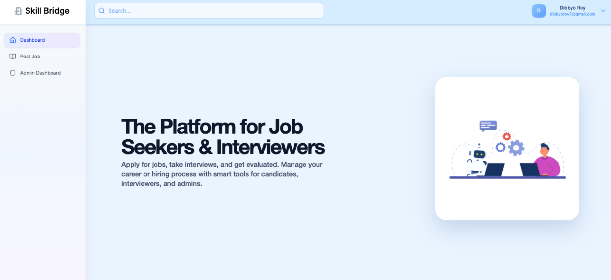

- Skill Assessment (quiz / evaluation)  
  

- Assessment Creation (for admins or mentors)  
  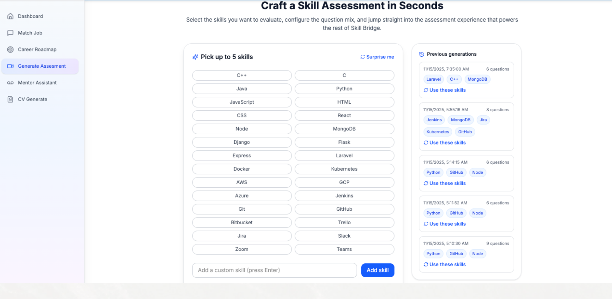

- Assessment Result  
  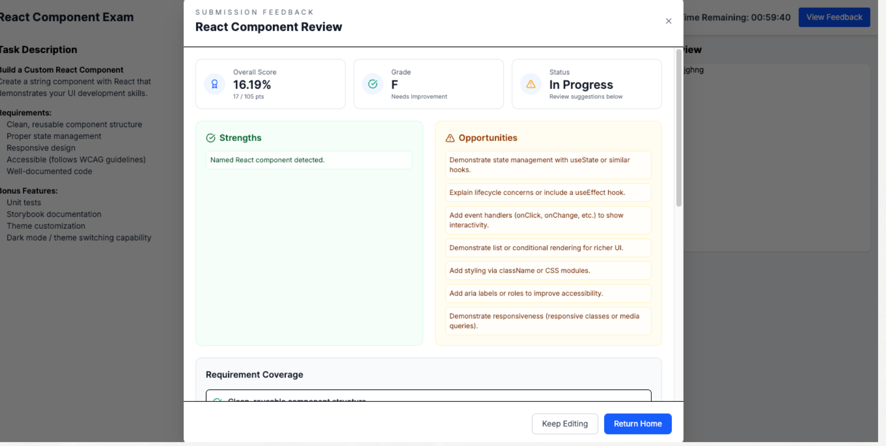

- Skill Gap Analysis  
  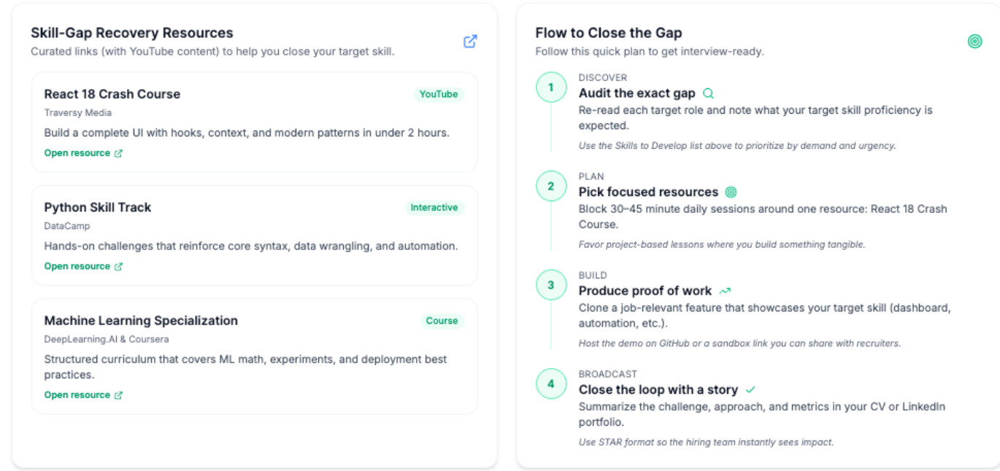

- Career / Skill Roadmap  
  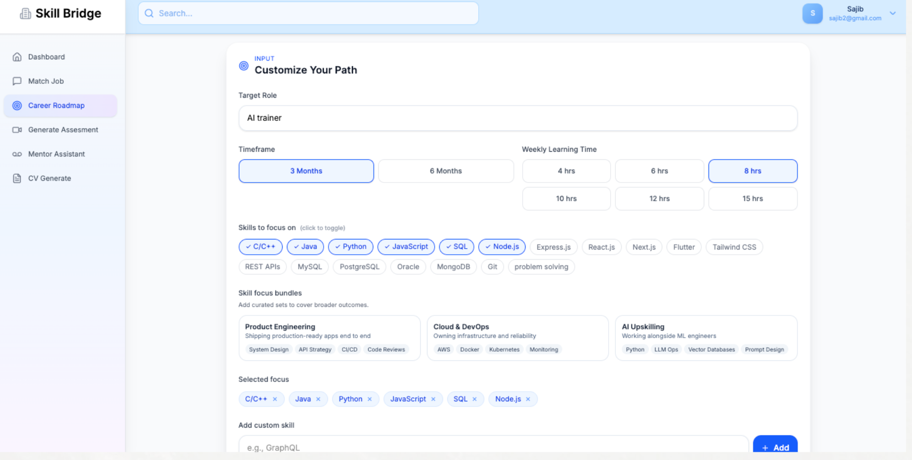

- AI Mentor / CareerBot  
  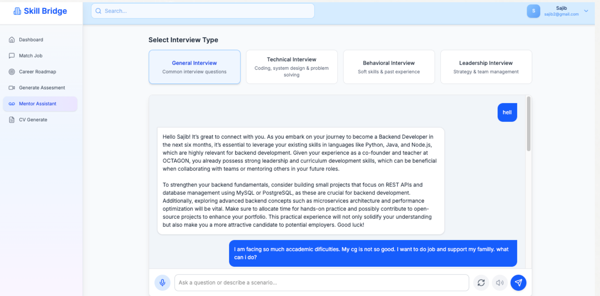

- Auto CV Generator  
  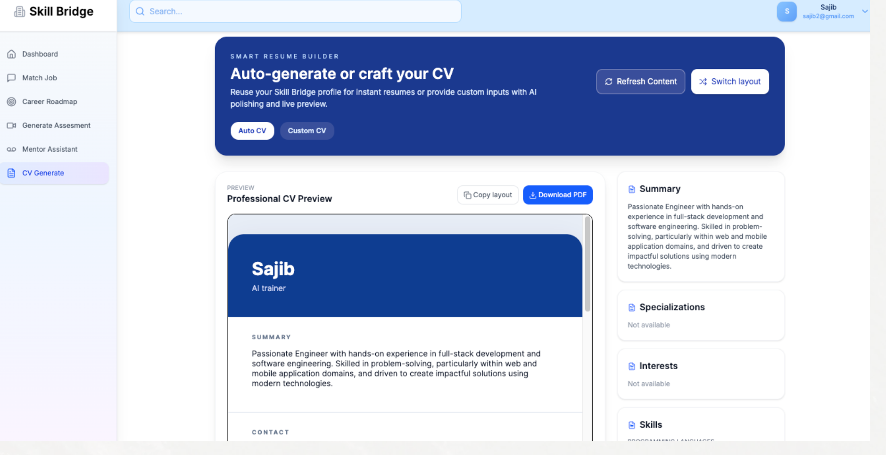

### Admin & Platform Management

- Admin Dashboard  
  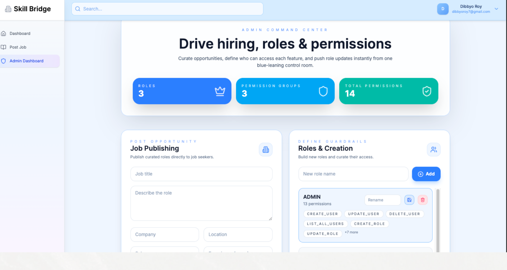

- Role API List / Role Management  
  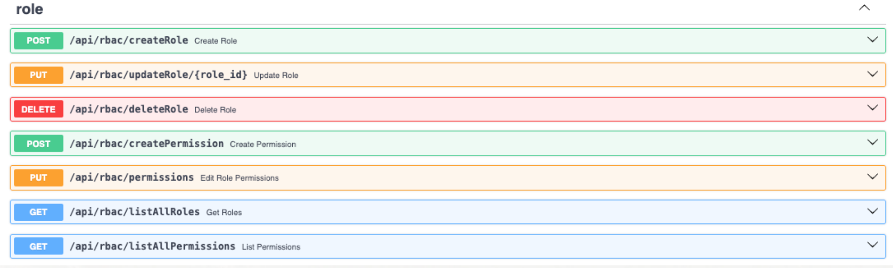

- Permission Management  
  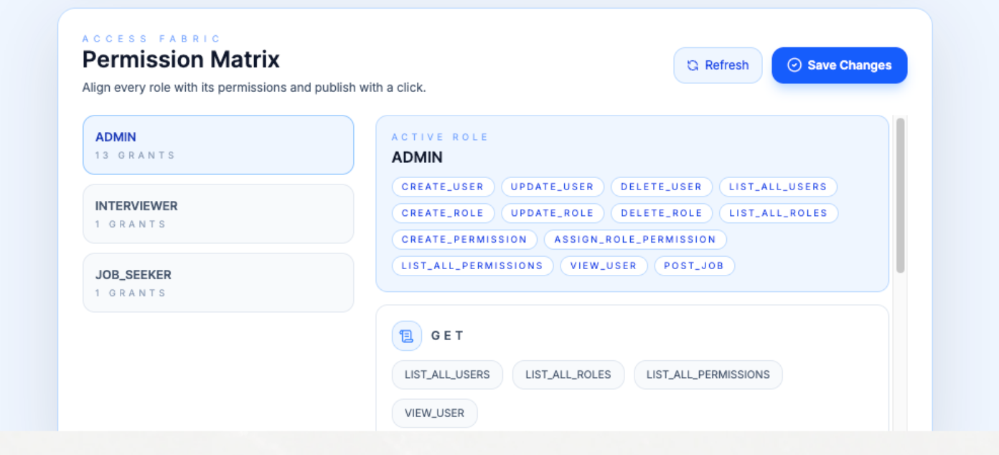

- Job Creation  
  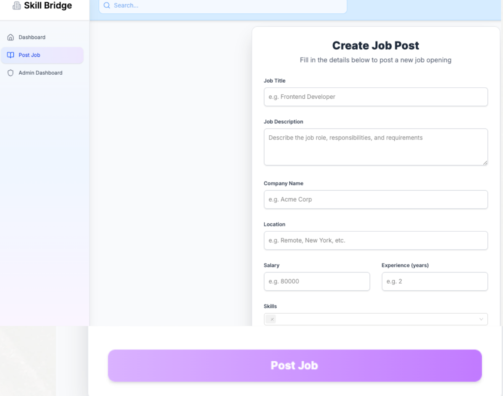

---

## Folder Structure

```bash
.
├─ BE/                     # FastAPI backend
│  ├─ main.py              # Application entrypoint
│  ├─ router/              # API route modules (auth, user, jobs, cv, chat, admin, etc.)
│  ├─ models.py            # SQLAlchemy models
│  ├─ database.py          # DB session & engine
│  ├─ config.py            # Configuration & environment loading
│  ├─ migration/           # Alembic migrations
│  ├─ cv_history_store/    # Stored CV history (JSON)
│  ├─ docker-compose.yml   # Local DB and services
│  └─ requirements.txt
│
├─ FE/                     # React + Vite frontend
│  ├─ src/
│  │  ├─ pages/            # Pages (Home, Auth, Dashboard, Admin, AI tools, Assessments)
│  │  ├─ components/       # Reusable UI components
│  │  ├─ context/          # Auth / app context
│  │  ├─ services/         # API service wrappers
│  │  └─ main.jsx
│  ├─ public/
│  └─ package.json
│
├─ assets/                 # Screenshots used in README / documentation
│  ├─ admin_dashboard.png
│  ├─ ai-mentor.png
│  ├─ assesment_creatation.png
│  ├─ assesment_result.png
│  ├─ auto_cv_generator.png
│  ├─ create_job.png
│  ├─ permi
